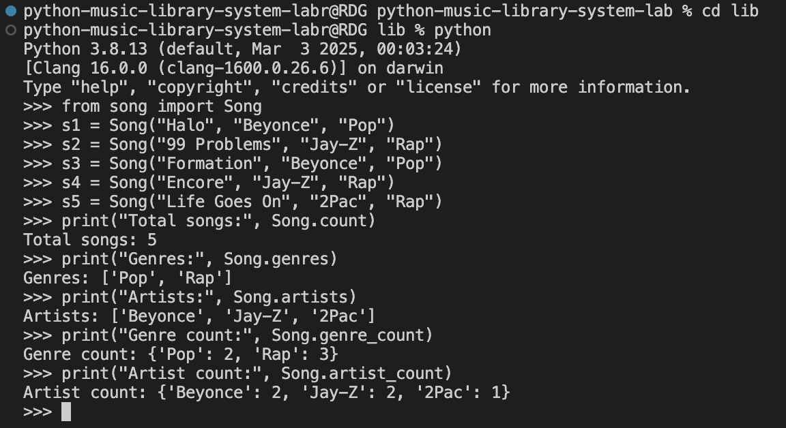

# Music Library System

Built a `Song` class to track global information about all songs in a music streaming system.  
Created class methods to manage song metadata like artist names, genres, and song counts, while updating class-level tracking every time a new `Song` instance is created.  

---

## Table of Contents  
- [Demo](#demo)  
- [Setup](#setup)  
- [Testing](#testing)  
- [Features](#features)  

---

## Demo  

---

## Setup

1. Fork and clone the repo  
2. Create a virtual environment: `python3 -m venv .venv`
3. Activate virtual environment: 
  - Mac/Linux: `source .venv/bin/activate`  
  - Windows ` .venv\Scripts\activate`

---

## Testing
  - Install pytest: `pip install pytest`
  - Run the provided test file:  `pytest`

---

## Features
	•	Create a Song instance with name, artist, and genre
	•	Automatically update global count of songs
	•	Track all unique genres and artists
	•	Count how many songs belong to each genre
	•	Count how many songs each artist has

⸻
